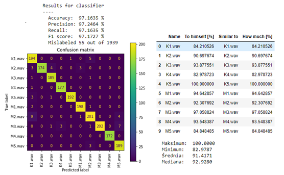
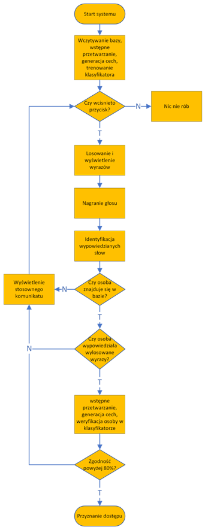
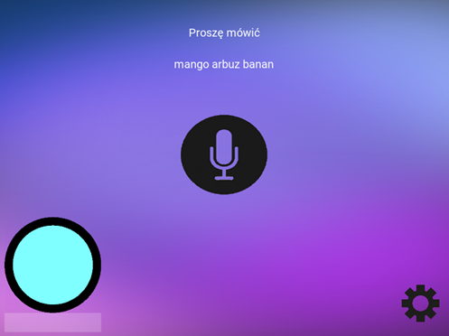
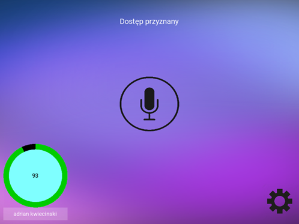

## Spis treści

* [Info](#general-info)
* [Jupyter Notebook](#Jupyter-Notebook)
* [GUI](#GUI)

## Info
Ten projekt jest w zasadzie pracą magisterską w której na podstwie cech fizjologicznych głosu realizowana jest kontrola dostępu. Projekt został podzielony na dwie części:
badawaczą w której realizowana jest ekstrakcja cech i dopór odpowiednich współczynników dla klasyfikatorów wraz z wyborem najlepszego na podstawie badań oraz
implementacyjną w której zrealizowano prototyp aplikacji z interfejsem GUI w celu implementacji na komputrze jednopłytkowym Nvidia Jetson nano. W wiekszości kod opiera się
o gotowe biblioteki ekstrakcji cech oraz klasyfikatorów lecz rozważam przepisanie części kodu w celu pozybcia się niektórych już przestarzałych bibliotek.
	
## Jupyter-Notebook
Notebook posłużył do wyboru klasyfikatora który został umieszczony w aplikacji z GUI. W tym celu przetestowałem działanie klasyfikatorów: regresji logistycznej, SVM, KNN
drzewa decyzyjnego, lasów losowych oraz MLP. Jako podstawowy wyznacznik posłużył Recall wyliczany z zbioru walidacyjnego a jako pomocniczne wartość maksymalna, minimalna, 
średnia, mediana ze zbioru testowego. Wybrano dwa najlepsze klasyfikatory na których przeprowadzono trzy kolejne badania: 

* ocena odporności systemu na odtwarzane nagranie
* próba weryfikacji osób z poza bazy
* ocena wpływu dźwięków otoczenia na weryfikację

na których podstawie został wybrany najlepszy klasyfiaktor. Poniżej przedstawiono przykładowy output dla klasyfikatora:

	
## GUI
Szereg badań eksperymentalnych oraz analiza ich wyników pozwoliły na określenie docelowej konstrukcji systemu. Za pomocą przeprowadzonych eksperymentów 
jako finalny klasyfikator został wdrożony SVM ze względu na większą odporność na odtwarzane nagranie z różnych mediów oraz wyższą skuteczność odrzucania osób z poza
bazy danych. Aby uniemożliwić próbę weryfikacji za pomocą nagrania wdrożono losowanie 3 wyrazów z danej puli 10 wyrazów które następnie osoba weryfikowana ma do 
przeczytania. Wypowiadana Fraza wygląda w następujący sposób : „[imię oraz nazwisko badanej osoby] [Wyraz 1] [Wyraz 2] [Wyraz 3]”. Schemat blokowy działania systemu 
został przedstawiony poniżej.

Sam wygląd aplikacji w trakcie weryfikacji oraz po przedstawiono poniżej.

Sama aplikacja wymaga wiele poprawy a tak naprawdę napisania na nowo. Moja zbyt mała wiedza o Kivy spowodowała zastosowanie wielu sztuczek którę powinienem wykonać 
innaczej
